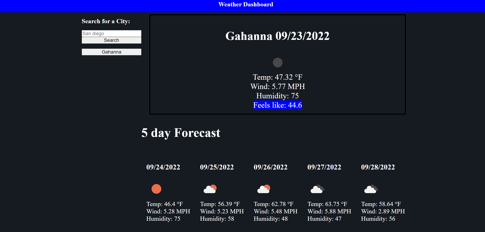
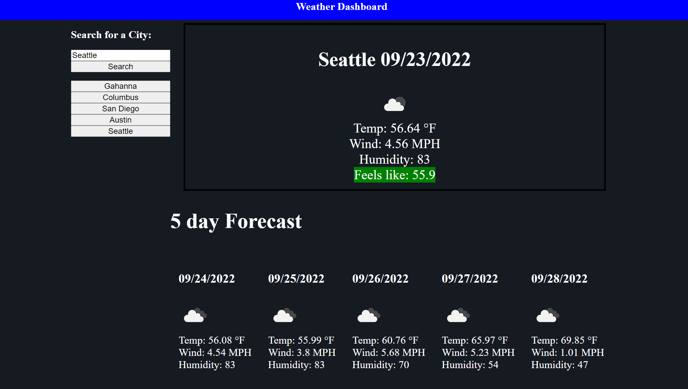

# weather-dashboard
I will be using a server side api to create a webpage that can be used to check the weather in various cities. I used local storage to store the city history.
This was created with the openweathermap.org api caller. I needed to allow users input a city and based on that input I return 
the forecast for the current day and 5 days out.

[Link to Website](https://wolfgang978.github.io/weather-dashboard/ "Weather Dashboard")